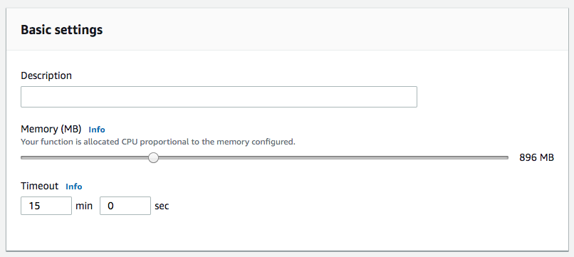

# canary-lambda

## Summary

This canary function is an early warning system that reports corrupt data. It is meant to run once a day on a schedule, sample Amazon Web Services (AWS) Simple Storage Service (S3) data uploaded that day, and then validate that it meets certain field constraints.

It utilizes the [ODE schema validation library](https://github.com/usdot-jpo-ode/ode-output-validator-library) to detect records with missing fields, blank fields, fields that do not match an expected range or value, as well as higher-level validations such as ensuring serial fields are sequential and incremented without gaps.

**Upcoming Feature:** Upon detection of erroneous records, this function will automatically distribute an alert message over email with a summary of the failures found.

## Requirements

- [Python 3.7](https://www.python.org/downloads/)
- [PIP](https://pip.pypa.io/en/stable/installing/)
- [AWS Lambda Access](https://aws.amazon.com/lambda/)
- [S3 Permissions within AWS](https://docs.aws.amazon.com/IAM/latest/UserGuide/list_amazons3.html)
  - `s3:Get*`
  - `s3:List*`
- [SES Permissions within AWS](https://docs.aws.amazon.com/IAM/latest/UserGuide/list_amazonses.html)
  - `ses:SendEmail`

## Deployment

This function is deployed manually by uploading a ZIP file to Lambda.

#### Part 1: Local packaging
1. Clone the code
```
git clone https://github.com/usdot-its-jpo-data-portal/canary-lambda.git
```
2. Install dependencies and package the code using the package.sh script:
```
./package.sh
```
3. A zip file named `canary.zip` will be created.

#### Part 2: Deployment to Lambda

1. [Create a Lambda function](https://docs.aws.amazon.com/lambda/latest/dg/getting-started-create-function.html)
  - Select **Python 3.7** as the runtime and **main.lambda_handler** as the handler.
2. Upload the `canary.zip` file

3. Set the Execution role to one that has the S3 and SES permissions listed in the **Requirements** section above.
4. Set the **Memory (MB)** to `512 MB` and the **Timeout** to `1 min 0 sec`.


## Configuration

**Note: This configuration is still in progress and will be added in the future.**

Configuration is _currently_ done in the code (in the future all configuration will be centralized into a CloudFormation template). You may change these values either via the Lambda UI or locally and then repackage your function and reupload the zip.

```
S3_BUCKET = "name-of-your-s3-bucket"  # Name of the S3 bucket that the function will analyze for data
SAMPLE_SIZE = 10                      # How many S3 files to analyze per invocation
SEND_EMAIL_ALERTS = False             # Whether or not to send failure notifications via email
SOURCE_EMAIL = "sender@email.com"     # Source email address to use for notifications (must be registered with SES)
DEST_EMAIL = "receiver@email.com"     # Destination email to which notifications are sent (must be verified with SES)
```

## Usage

Run the function on a schedule by [setting up a CRON-triggered CloudWatch event](https://docs.aws.amazon.com/AmazonCloudWatch/latest/events/RunLambdaSchedule.html).

## Limitations

**TODO**
